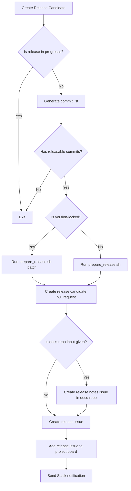

# create-release-candidate-v1

A GitHub Action to create a release candidate.

## Inputs

| Name             | Required | Description                                                                                         | Default |
| ---------------- | -------- | --------------------------------------------------------------------------------------------------- | ------- |
| `token`          | Yes      | A GitHub token used for octokit and GH CLI with the required permissions                            | NA      |
| `base`           | Yes      | The branch the pull request will be merged into                                                     | NA      |
| `head`           | Yes      | The branch that contains the changes the pull request is trying to merge                            | NA      |
| `shell-script`   | Yes      | The location of the `prepare_release.sh` shell script that creates the changelogs and version bumps | NA      |
| `slack-webhook`  | No       | The Slack webhook to send the release candidate notification to                                     | NA      |
| `version-locked` | No       | Whether or not the version should be locked to axe-core                                             | `false` |
| `docs-repo`      | No       | The name of the repo where the release notes live                                                   | `null`  |

## Example usage

```yaml
name: Create release candidate

on: workflow_dispatch

jobs:
  create-project-issue:
    runs-on: ubuntu-latest
    steps:
      - uses: dequelabs/axe-api-team-public/.github/actions/create-release-candidate-v1@main
        with:
          token: ${{ secrets.PAT }}
          slack-webhook: ${{ secrets.SLACK }}
          base: 'main'
          head: 'develop'
          version-locked: 'false'
          shell-script: 'prepare_release.sh'
          docs-repo: 'docs-developer-hub'
        env:
          GH_TOKEN: ${{ secrets.PAT }}
```

## Permissions

This action requires the following permission scopes:

- `repo` - To create the issue within private repositories
- `workflow` - To access the `GITHUB_TOKEN` secret
- `write:org` - To add the issue to a project board
- `read:org` - To read the project board
- `project` - access to project board

## Action Flow


