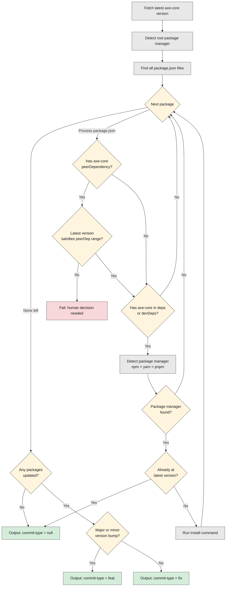

# update-axe-core-v1

A GitHub action for updating axe-core to the latest stable version.

- It updates `package.json`, `yarn.lock`, `package-lock.json`, and `pnpm-lock.yaml`.
- It is compatible with both workspaces and non-workspaces monorepos.
- It auto-updates dependencies and devDependencies.
- It validates that peerDependency ranges satisfy the new version.
- It maintains whatever pinning strategy was already in place (`~`, `^`, or `=`).
- It does _not_ commit changes or create a PR.

Workflows should generally use [create-update-axe-core-pull-request](../create-update-axe-core-pull-request-v1/README.md) instead of using this action directly.

## How it works



## Outputs

| Name          | Description                                                                                                                     |
| ------------- | ------------------------------------------------------------------------------------------------------------------------------- |
| `commit-type` | `feat` if axe-core updated to a major or minor version, `fix` if it updated to a patch version, or `null` if no update occurred |
| `version`     | The version that axe-core was updated to                                                                                        |

## Example usage

```yaml
name: Update axe-core

on:
  schedule:
    # Run every night at midnight
    - cron: '0 0 * * *'
  workflow_dispatch:

jobs:
  build:
    runs-on: ubuntu-latest
    steps:
      - uses: actions/checkout@v6
      - uses: actions/setup-node@v6
        with:
          node-version: 24
      - id: update
        uses: dequelabs/axe-api-team-public/.github/actions/update-axe-core-v1@main
```
